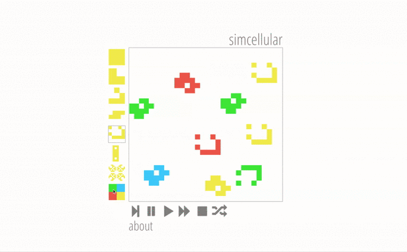

# simcellular_qt

#### Angular 4 web application, Oct 2019

#### By Russell Hofvendahl

## Description

An implementation of Conway's Game of Life, a cellular automaton in which each state is determined by the state prior according to a few simple rules. Application built with Qt, coverage through Google Test.

Original project live at http://simcellular.us.



## Setup/Installation

First, clone repository and navigate to directory:
```
git clone https://github.com/rhofvendahl/simcellular_qt
cd simcellular_qt
```
To run:
```
cd simcellular_qt_build
./simcellular_qt
```
To test:
```
cd simcellular_googletest_build
./simcellular_googlet
```
To develop:
1. install Qt Creator with Qt5 ([guide](https://doc.qt.io/qt-5/gettingstarted.html here)).
2. In Qt Creator select "file -> open file or project -> simcellular_qt.pro".

## Technologies Used

Qt, Google Test

### License

Copyright (c) 2018 Russell Hofvendahl

Permission is hereby granted, free of charge, to any person obtaining a copy of this software and associated documentation files (the "Software"), to deal in the Software without restriction, including without limitation the rights to use, copy, modify, merge, publish, distribute, sublicense, and/or sell copies of the Software, and to permit persons to whom the Software is furnished to do so, subject to the following conditions:

The above copyright notice and this permission notice shall be included in all copies or substantial portions of the Software.

THE SOFTWARE IS PROVIDED "AS IS", WITHOUT WARRANTY OF ANY KIND, EXPRESS OR IMPLIED, INCLUDING BUT NOT LIMITED TO THE WARRANTIES OF MERCHANTABILITY, FITNESS FOR A PARTICULAR PURPOSE AND NONINFRINGEMENT. IN NO EVENT SHALL THE AUTHORS OR COPYRIGHT HOLDERS BE LIABLE FOR ANY CLAIM, DAMAGES OR OTHER LIABILITY, WHETHER IN AN ACTION OF CONTRACT, TORT OR OTHERWISE, ARISING FROM, OUT OF OR IN CONNECTION WITH THE SOFTWARE OR THE USE OR OTHER DEALINGS IN THE SOFTWARE.
